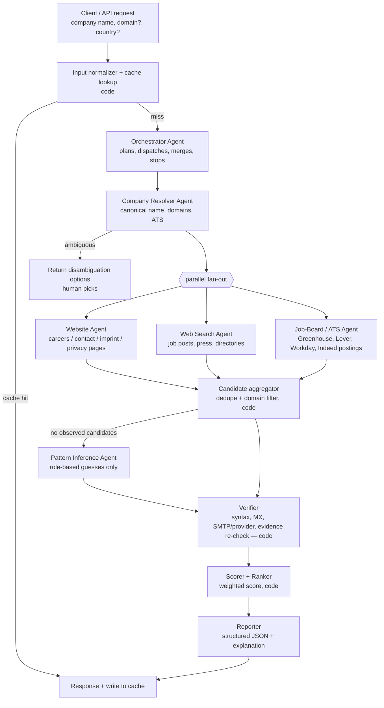

# HR Email Finder — Multi-Agent System Design

**Goal:** given a company (name, and optionally a domain/country/LinkedIn URL), return the best
publicly available HR / recruiting contact email, with evidence, a confidence score, and
alternatives — or an honest "no public HR email; use this careers portal / contact form instead".

**Non-goals:** scraping login-walled sites (LinkedIn, etc.), harvesting personal emails of
individual employees by default, bulk outreach/sending.

---

## 1. Design principles

1. **Evidence or it didn't happen.** Every returned email must carry a `source_url` + the exact
   snippet it was found in, and the Verifier re-checks that the snippet still contains it. Emails
   that were *guessed* (pattern inference) are always labelled `inferred` and capped in confidence.
   This is the main defence against LLM hallucination.
2. **LLMs for fuzzy work, code for deterministic work.** Agents decide *where to look* and *how to
   interpret a page*. Plain code does DNS/MX checks, SMTP verification, deduplication, scoring,
   caching, and budget enforcement.
3. **Role-based addresses first.** `hr@`, `careers@`, `jobs@`, `recruiting@`, `talent@`,
   `people@` are the target. Named-person emails are an opt-in mode (see §8 Compliance).
4. **Cheap path first, early exit.** Most companies are solved by their own website (careers,
   contact, imprint/impressum, privacy policy pages). Fan out to broader search only if needed.
5. **Fetched web content is untrusted.** Page text can never instruct an agent; workers only ever
   return structured data.

---

## 2. Architecture



**Pattern:** a code-driven state machine (the pipeline above) where the *Orchestrator* is an LLM
agent that only decides plan adjustments — which workers to run, whether to stop early, whether
results are good enough. This keeps the run predictable and cheap while still letting the model
adapt (e.g. "the site is in German — check the *Impressum*").

---

## 3. Agents

| # | Agent | Kind | Model (default) | Tools | Output |
|---|---|---|---|---|---|
| 0 | **Orchestrator** | LLM | `claude-opus-5-5`, effort `medium` | `dispatch_worker`, `get_candidates`, `finish` | plan decisions, final selection |
| 1 | **Company Resolver** | LLM | `claude-opus-5-5`, effort `low` | `web_search`, `web_fetch`, `company_lookup` (optional data API) | `CompanyProfile` |
| 2 | **Website Agent** | LLM | `claude-opus-5-5`, effort `low` | `crawl_site`, `fetch_page`, `extract_emails` | `EmailCandidate[]` |
| 3 | **Web Search Agent** | LLM | `claude-opus-5-5`, effort `low` | `web_search`, `web_fetch`, `extract_emails` | `EmailCandidate[]` |
| 4 | **Job-Board / ATS Agent** | LLM | `claude-opus-5-5`, effort `low` | `web_search`, `fetch_page`, `ats_api` | `EmailCandidate[]`, `careers_portal_url` |
| 5 | **Pattern Inference** | LLM-lite | `claude-opus-5-5`, effort `low` | none (pure reasoning over profile) | `EmailCandidate[]` (type `inferred`) |
| 6 | **Verifier** | code | — | `dns_mx`, `smtp_probe` / verification API, `refetch_and_match` | `VerificationResult` |
| 7 | **Scorer** | code | — | — | ranked candidates |
| 8 | **Reporter** | LLM (structured output) | `claude-opus-5-5`, effort `low` | none | `FinalReport` |

> **Cost tuning:** start with one model at low effort for workers (single cache namespace, simplest
> to measure). If eval shows quality holds, move the page-reading workers (2–4) to
> `claude-sonnet-5-5`, and pure page → JSON extraction to `claude-haiku-4-5`. Note: the newer
> `web_search_20260209` / `web_fetch_20260209` tools need Opus 5.5 / Sonnet 5.5 (or other recent
> Opus/Sonnet); Haiku 4.5 must use the basic `web_search_20250305` variant or no web tools.

### 3.0 Orchestrator
- Receives `CompanyQuery`, calls Resolver, then fans out workers in parallel.
- Early stop rule: if any candidate reaches **score ≥ 0.85** after verification, cancel remaining
  workers (or let them finish only if under budget).
- If nothing observed → triggers Pattern Inference, then Verifier.
- Never writes an email itself; it can only *select* from verified candidates.

**System prompt sketch**
```
You coordinate a team that finds a company's public HR / recruiting contact email.
You never produce an email address yourself — you choose among candidates returned by tools,
each of which carries evidence. Prefer role-based addresses on the company's own domain.
If no candidate is good enough, say so and return the careers portal or contact form instead.
Stay within the budget reported by get_candidates(); stop as soon as a candidate scores ≥ 0.85.
```

### 3.1 Company Resolver
- Disambiguates ("Apollo" → Apollo Hospitals? Apollo Tyres? Apollo.io?) using country, industry,
  LinkedIn URL hints. If two or more plausible matches remain → return them to the user.
- Finds **all** domains (e.g. `tcs.com`, `tata.com`, regional ccTLDs, acquired brands) because HR
  email may live on a parent/group domain.
- Detects the ATS (Greenhouse, Lever, Workday, SmartRecruiters, Darwinbox, Zoho Recruit…) from the
  careers link — feeds Agent 4.

### 3.2 Website Agent
Priority page list (stop when a high-quality candidate is found):
1. `/careers`, `/jobs`, `/join-us`, `/work-with-us`
2. `/contact`, `/contact-us`
3. `/impressum`, `/imprint`, `/legal` (EU sites legally must list contact details)
4. `/privacy`, `/privacy-policy` (often lists a DPO/HR contact for applicant data)
5. `/about`, footer links, sitemap.xml entries containing career/hr/recruit keywords

Extraction handles obfuscation: `hr [at] company [dot] com`, `mailto:` links, HTML entities,
Cloudflare email protection (`/cdn-cgi/l/email-protection` decoding), and emails in images
(optional OCR). Respects `robots.txt` and a per-domain rate limit.

### 3.3 Web Search Agent
Query templates (the agent adapts them):
```
"@{domain}" (hr OR careers OR recruitment OR jobs)
"{company}" "send your resume to" OR "send your CV to"
"{company}" hr email
site:{domain} careers email
"{company}" "talent acquisition" email
```
Keeps only emails on a company-owned domain (from `CompanyProfile.domains`) unless explicitly
flagged as the company's (e.g. a Gmail address listed on the official careers page — low score).

### 3.4 Job-Board / ATS Agent
- Public job postings frequently contain "Apply to: careers@…". Uses ATS public endpoints where
  available (e.g. Greenhouse/Lever public job board APIs) and search results for Indeed/Naukri
  postings — no logged-in scraping.
- Always returns the **careers portal URL** as a fallback answer.

### 3.5 Pattern Inference (last resort)
- Generates role-based guesses only: `hr@`, `careers@`, `jobs@`, `recruitment@`, `talent@`,
  `people@`, `hiring@` on the primary domain, ordered by industry/region priors (e.g. India:
  `hr@`, `careers@`; US tech: `recruiting@`, `talent@`).
- Results are typed `inferred`, need Verifier confirmation, and are capped at score 0.5.

### 3.6 Verifier (deterministic)
| Check | How | Effect |
|---|---|---|
| Syntax | RFC 5322-lite regex + IDNA | reject if invalid |
| Domain ownership | email domain ∈ `CompanyProfile.domains` | big penalty otherwise |
| MX record | `dnspython` MX lookup | reject if no MX/A |
| Mailbox | 3rd-party verification API (ZeroBounce / NeverBounce / similar) **or** gentle SMTP `RCPT TO` probe | `valid` / `invalid` / `catch_all` / `unknown` |
| Disposable / free | blocklist (gmail, yahoo, mailinator…) | penalty |
| Evidence | re-fetch `source_url`, confirm the email still appears | drop if gone (or mark stale) |

> Raw SMTP probing from your own IP gets blocklisted quickly and many servers are catch-all;
> prefer a verification provider in production.

### 3.7 Scorer
Weighted, explainable score (0–1), clamped:

| Signal | Weight |
|---|---|
| Found on company's own domain, on a careers/HR page | +0.45 |
| Found in an official job posting (company ATS) | +0.35 |
| Found on a third-party page only | +0.15 |
| HR keywords (hr, career, recruit, talent, hiring, resume, CV) within 200 chars | +0.15 |
| Role-based local part (`hr`, `careers`, `jobs`…) | +0.10 |
| Mailbox `valid` / `catch_all` / `unknown` | +0.15 / +0.05 / 0 |
| Seen on ≥ 2 independent sources | +0.10 |
| Domain not company-owned | −0.50 |
| Free / disposable mailbox | −0.30 |
| `inferred` (never observed) | cap at 0.50 |
| Mailbox `invalid` | reject |

Every applied rule is recorded in `reasons[]` so the report can explain the score.

### 3.8 Reporter
Single Claude call with **structured outputs** (`output_config.format` with the `FinalReport`
JSON schema, or `client.messages.parse()` with a Pydantic model) to produce the final answer and a
one-paragraph human explanation. It may only reference candidates passed to it.

---

## 4. Data contracts (Pydantic)

```python
class CompanyQuery(BaseModel):
    name: str
    domain: str | None = None
    country: str | None = None
    linkedin_url: str | None = None
    allow_named_contacts: bool = False      # §8

class CompanyProfile(BaseModel):
    canonical_name: str
    domains: list[str]                       # primary first
    hq_country: str | None
    industry: str | None
    size_band: str | None                    # "1-50", "51-500", ...
    careers_url: str | None
    ats_provider: str | None                 # "greenhouse", "lever", "workday", ...
    alternatives: list[str] = []             # other plausible matches if ambiguous
    confidence: float

class EmailCandidate(BaseModel):
    email: str
    kind: Literal["role_based", "named_person", "generic", "inferred"]
    department_hint: str | None              # "HR", "Recruiting", "General"
    source_url: str | None                   # None only for inferred
    snippet: str | None                      # exact text around the email
    found_by: str                            # agent name
    found_at: datetime

class VerificationResult(BaseModel):
    syntax_ok: bool
    domain_owned: bool
    mx_ok: bool
    mailbox: Literal["valid", "invalid", "catch_all", "unknown"]
    disposable_or_free: bool
    evidence_confirmed: bool | None

class RankedCandidate(BaseModel):
    candidate: EmailCandidate
    verification: VerificationResult
    score: float
    reasons: list[str]

class FinalReport(BaseModel):
    company: CompanyProfile
    best_email: RankedCandidate | None
    alternatives: list[RankedCandidate]
    careers_portal_url: str | None
    contact_form_url: str | None
    status: Literal["found", "inferred_only", "not_found", "ambiguous_company"]
    explanation: str
    cost_usd: float
    duration_ms: int
```

---

## 5. Tool definitions (custom, client-side)

| Tool | Args | Notes |
|---|---|---|
| `crawl_site` | `domain`, `paths[]`, `max_pages` | robots.txt aware, per-domain rate limit, returns cleaned text + links |
| `fetch_page` | `url` | httpx + readability cleanup; JS-heavy pages → Playwright fallback |
| `extract_emails` | `text`, `url` | regex + de-obfuscation + Cloudflare decode; returns emails with ±200-char snippets |
| `company_lookup` | `name`, `country?` | optional enrichment API (domain, size, industry) |
| `ats_api` | `provider`, `board_token` | public Greenhouse/Lever/etc. job-board endpoints |
| `dispatch_worker` | `worker`, `instructions` | orchestrator → worker (runs a sub-agent loop) |
| `get_candidates` | — | aggregated, verified, scored list + remaining budget |
| `finish` | `selected_email?`, `status` | ends the run |

Server-side tools (Anthropic-hosted): `web_search_20260209` and `web_fetch_20260209` with
`max_uses` caps. Mark every custom tool `strict: true` so arguments always validate.

---

## 6. Implementation stack

- **Language:** Python 3.11+ (assumed — say if you prefer TypeScript).
- **Agent runtime:** Anthropic Python SDK — **Tool Runner** (`client.beta.messages.tool_runner`
  with `@beta_tool`) for each agent loop; the pipeline/state machine is plain `asyncio`.
  *Alternative:* Claude Managed Agents multiagent sessions if you want Anthropic to host the loop;
  but DNS/SMTP verification and crawling still need your own infra, so self-hosting is simpler here.
- **Model API notes (current models):**
  - `thinking: {type: "adaptive"}`, control depth with `output_config.effort`
    (Opus 5.5 defaults to `medium`; set `low` explicitly for workers).
  - Forced `tool_choice` (`any` / `tool`) is rejected on Opus 5.5 / Sonnet 5.5 — use `auto` +
    instructions + `strict: true` tools, and structured outputs for the final JSON.
  - Handle `stop_reason == "refusal"` and enable server-side fallbacks
    (`fallbacks: "default"`, beta `server-side-fallback-2026-07-01`).
  - Prompt-cache each agent's static system prompt + tool list.
  - Return all parallel `tool_result` blocks in a single user message.
- **Crawling:** `httpx` (async) + `selectolax`/`readability-lxml`; Playwright for JS-rendered pages.
- **DNS / verification:** `dnspython`; optional verification-provider API.
- **API:** FastAPI — `POST /lookup` (sync, ≤ 60 s) and `POST /lookup/batch` (async job + webhook).
- **Storage:** Postgres (results, evidence, audit log) + Redis (cache, rate limits, job queue).
- **Observability:** OpenTelemetry traces per run (agent → tool spans), token + cost per run.

### Suggested layout
```
hr-email-finder/
  app/
    api.py                 # FastAPI endpoints
    pipeline.py            # state machine / orchestrator wiring
    schemas.py             # Pydantic contracts (§4)
    scoring.py             # §3.7
    agents/
      orchestrator.py  resolver.py  website.py  search.py  ats.py  inference.py  reporter.py
    tools/
      crawl.py  robots.py  extract.py  dns.py  verify.py  ats_api.py  cache.py
    prompts/               # one .md system prompt per agent
  evals/
    golden.jsonl           # company → known HR email(s)
    run_eval.py
  tests/
```

---

## 7. Budgets, caching, failure handling

| Limit (per lookup) | Default |
|---|---|
| Wall-clock timeout | 60 s (sync API) |
| `web_search` uses | 8 total |
| Pages fetched | 20 total, 3 concurrent per domain |
| Tokens per worker | ~40K input / 3K output |

Rough token cost at list price with all-Opus 5.5 ($4 in / $20 out per 1M tokens): ~4 agent calls ×
(40K in + 3K out) ≈ 160K in + 12K out ≈ **$0.64 + $0.24 ≈ $0.90 per uncached lookup**, plus web
search fees. Early exit on the website path and moving workers to cheaper models typically cuts this
substantially — **measure on the eval set before deciding.**

- **Result cache:** keyed by primary domain, TTL 30 days; re-verify mailbox on read if older than 7 days.
- **Negative cache:** "not found" cached for 7 days.
- **Retries:** SDK retries 429/5xx; crawler retries with backoff; one worker failing never fails the run.
- **Degraded answers:** if verification provider is down → return `mailbox: unknown` with lower score.

---

## 8. Compliance & safety

- **Scope of data:** default to role-based addresses (not personal data in most regimes).
  Named-person mode (`allow_named_contacts=true`) returns only emails a person published
  themselves in a professional context, records the source, and requires the operator to have a
  lawful basis (GDPR legitimate-interest assessment / CCPA notice).
- **Retention:** store emails + evidence with TTL; support deletion requests (suppression list).
- **Site terms:** obey `robots.txt`, identify the crawler via User-Agent, no logins, no CAPTCHA
  bypassing, no LinkedIn scraping.
- **Anti-spam:** this service discovers contacts; any downstream outreach must follow CAN-SPAM /
  GDPR / India DPDP Act rules (opt-out, accurate sender, rate limits).
- **Prompt injection:** page text is wrapped as data; workers' output is schema-validated; the
  orchestrator can't invent emails (§1.1); tools have no side effects beyond reading.

---

## 9. Evaluation

Golden set of 100–200 companies across sizes, industries and countries with manually verified HR
emails (plus some with *no* public HR email).

| Metric | Target |
|---|---|
| Precision@1 (best email correct) | ≥ 90 % |
| Coverage (found or valid fallback portal) | ≥ 95 % |
| Fabricated emails (no evidence and not labelled `inferred`) | **0** |
| False "found" on companies with no public HR email | ≤ 5 % |
| p50 / p95 latency | ≤ 20 s / ≤ 60 s |
| Cost per lookup | track; compare model/effort configs |

Run the eval on every prompt/model change; compare configs (all-Opus-low vs Sonnet workers, etc.).

---

## 10. Build plan

1. **MVP (no LLM orchestration):** Resolver + Website Agent + Verifier + Scorer → CLI.
2. Add Web Search + ATS agents in parallel, aggregator, early exit.
3. Add Orchestrator agent, Pattern Inference, Reporter with structured output.
4. FastAPI service, caching, batch endpoint, observability.
5. Eval harness + cost/model tuning; compliance features (suppression list, retention jobs).
